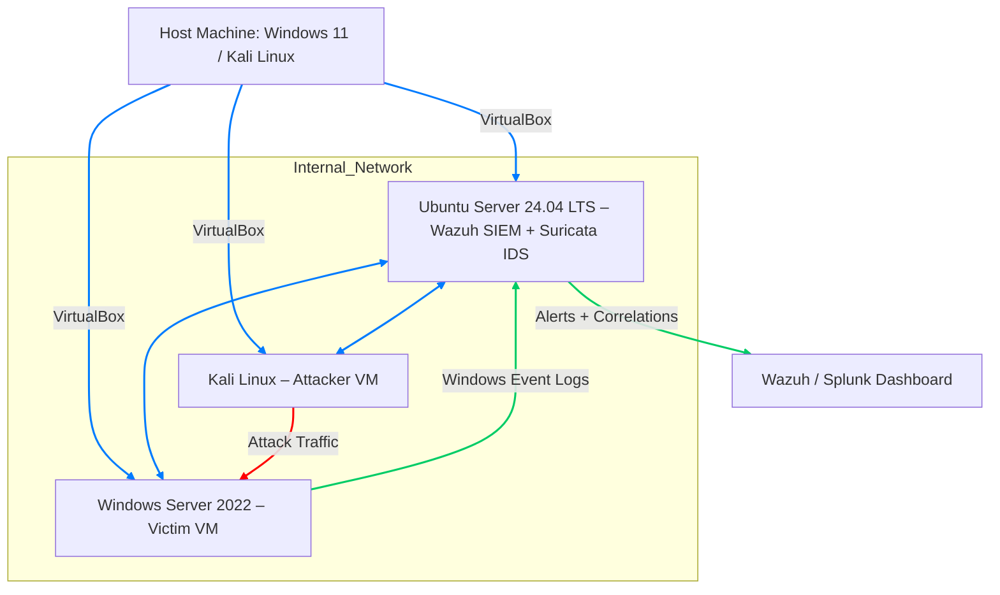
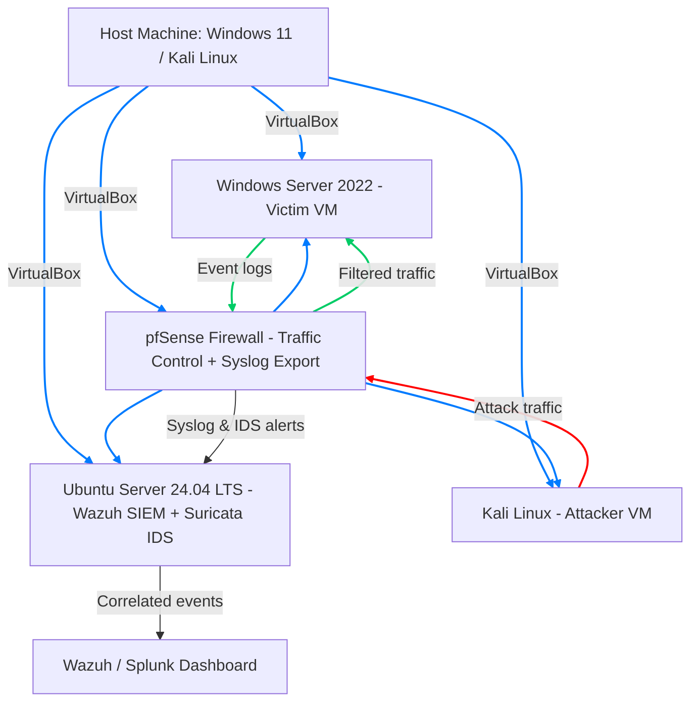
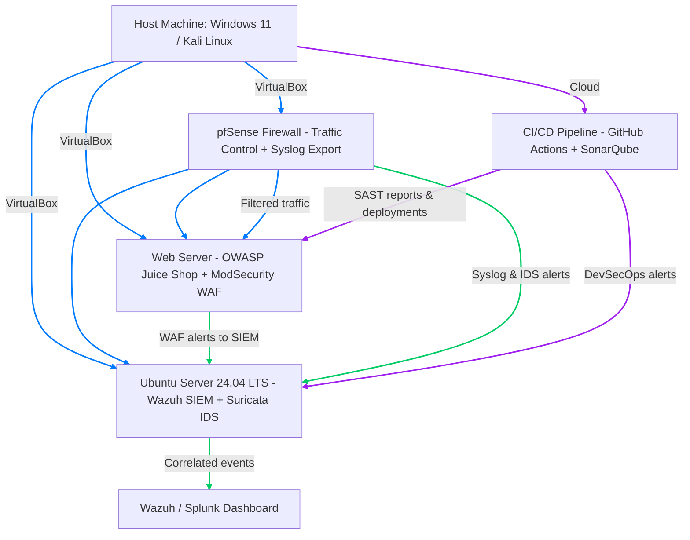
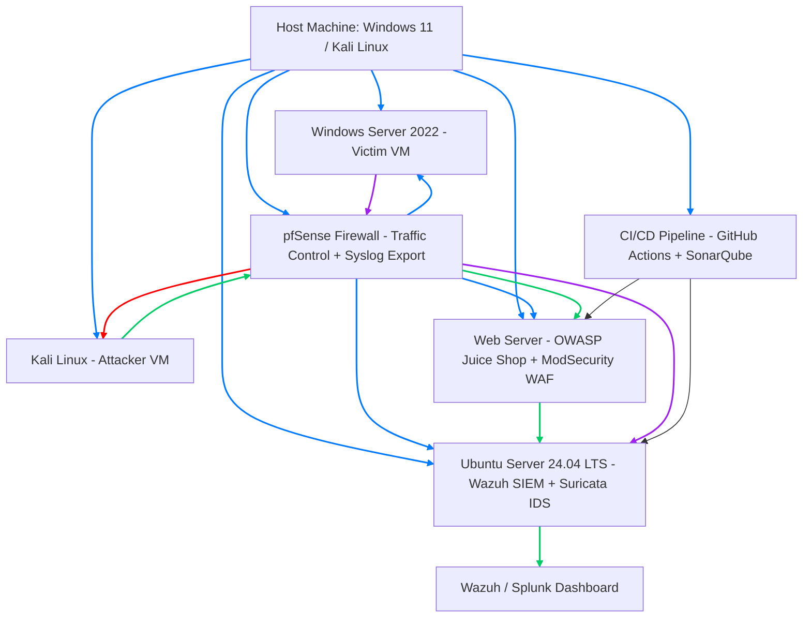

# Abhiudya's 180-Day Cybersecurity Portfolio

### M.Sc. Cybersecurity | (ISC)² CC | SOC • AppSec • DevSecOps

Welcome to my 6-month challenge to move from advanced theory to job-ready, hands-on practice.  
This repository is the single source of truth for all my projects, labs, and write-ups.

[Connect with me on LinkedIn](https://www.linkedin.com/in/abhiudya-dwivedi)  
[Follow me on X (Twitter)](https://twitter.com/0xabhiudya)

---

## 🚀 My 6-Month Roadmap

Each project lives in its own folder with:
- Full technical write-up (Markdown)
- Code or configs
- Screenshots & architecture diagrams

### 🛡️ Phase 1: SOC & Network Defense (Months 1–3)
- [ ] **Project 01:** SIEM-in-a-Box (Wazuh)
- [ ] **Project 02:** Splunk Dashboard Showcase
- [ ] **Project 03:** Network IDS (Suricata) & Custom Rule
- [ ] **Project 04:** pfSense Firewall Lab

### 💻 Phase 2: AppSec & DevSecOps (Months 4–5)
- [ ] **Project 05:** Manual Pentesting (OWASP Juice Shop)
- [ ] **Project 06:** SAST Integration (SonarQube)
- [ ] **Project 07:** Secure CI/CD Pipeline

### ⚡ Phase 3: The Capstone (Month 6)
- [ ] **Project 08:** The Hybrid Kill Chain (WAF → SIEM → Alert)

---

## 🧩 My Lab Setup

| Component | Tool/OS | Notes |
|------------|----------|-------|
| **Host OS** | Windows 11 / Kali Linux (Dual Boot) | Primary host environment |
| **Virtualization** | VirtualBox | All VMs managed here |
| **Attacker VM** | Kali Linux | Pentesting & red team |
| **Server/SIEM VM** | Ubuntu Server 24.04 LTS | Wazuh, Suricata, Splunk |
| **Victim VM** | Windows Server 2022 | Exploitation & defense testing |

---

## 🧠 About Me

I'm **Abhiudya Dwivedi (0xabhiudya)** — an M.Sc. Cybersecurity graduate building a public portfolio in SOC, AppSec, and DevSecOps.  
I document the wins, the broken configs, and the Zenitsu-level panic moments along the way.

---

⚡ *Follow this repo for daily updates, commits, and chaos.*

**GitHub:** [github.com/0xabhiudya](https://github.com/0xabhiudya)  
**LinkedIn:** [linkedin.com/in/abhiudya-dwivedi](https://www.linkedin.com/in/abhiudya-dwivedi)

## 🧩 Phase 1 – SOC & Network Monitoring

## 🧱 Phase 2 – Network Defense with pfSense

## ⚙️ Phase 3 – AppSec + DevSecOps Integration

## 🧱 Lab Architecture Diagram (Full 180-Day Evolution)

